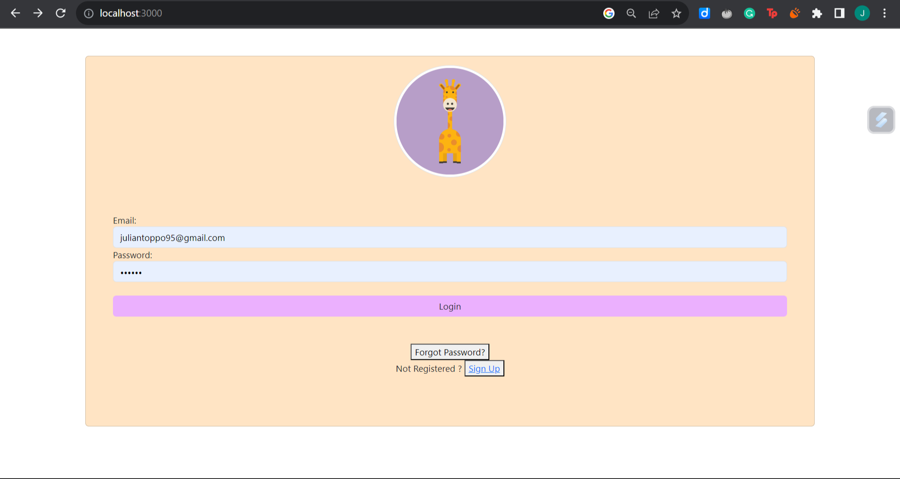
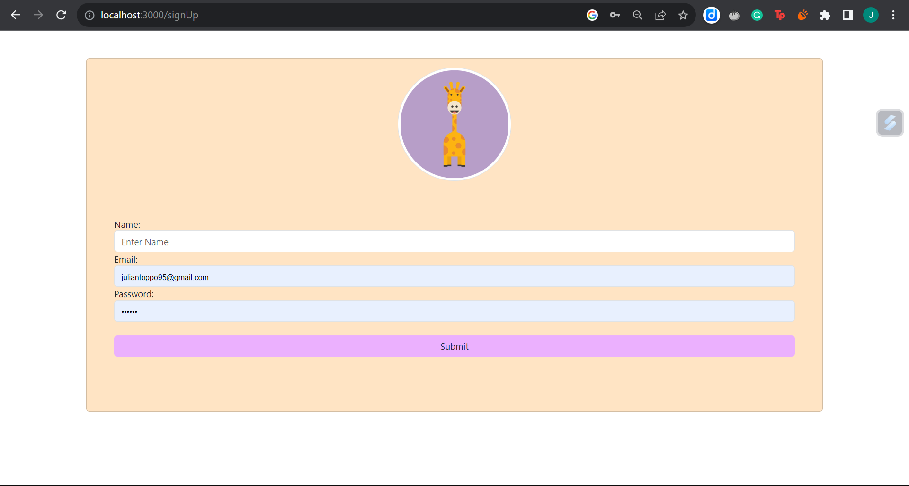
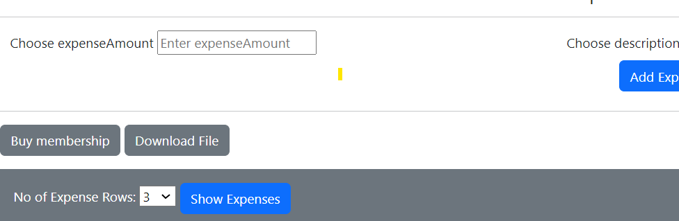
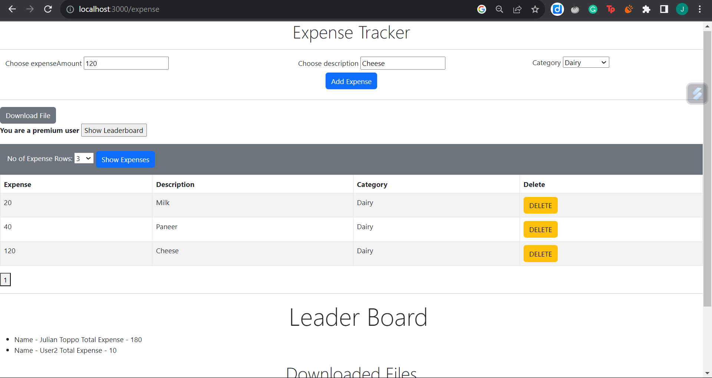
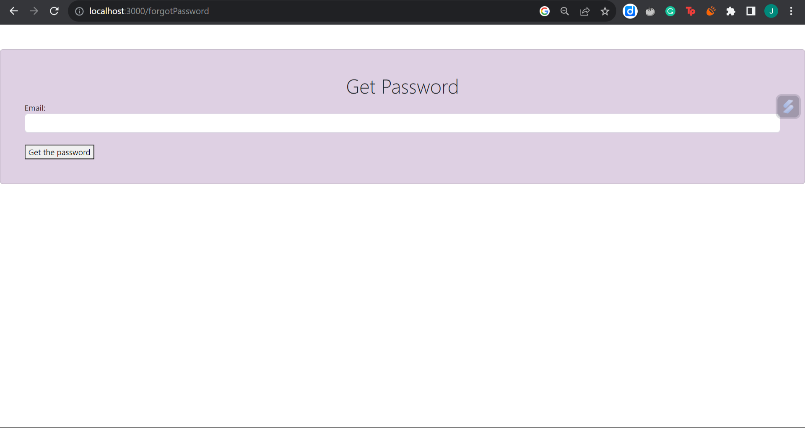
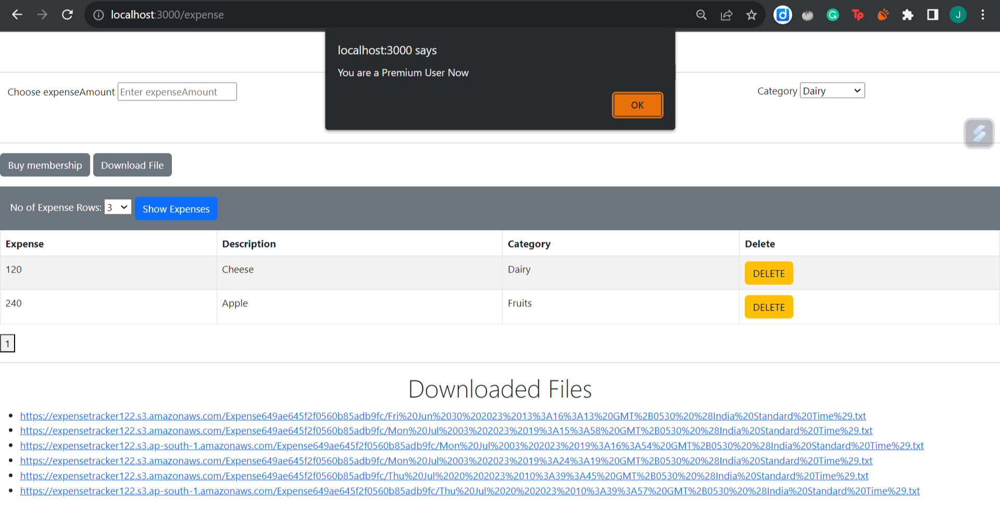

<h1 align="center" id="title">Expense Tracker</h1>

<p align="center"></p>

<p id="description">An Expense Tracker is a financial tool or application designed to help individuals or businesses monitor and manage their expenses.We can categorize our expenses and make informed decisions about their budgeting and spending habits.I have build this project as part of my learning express and MVC architecture.It mainly aims at understanding the rendering of different pages and gives you the insight of using payment systems and sending cross website links for resetting passwords.</p>

<h2>🚀 Demo</h2>

[https://www.veed.io/view/17753f69-94b8-4279-b4cc-15421f2b93e6?panel=share](https://www.veed.io/view/17753f69-94b8-4279-b4cc-15421f2b93e6?panel=share)

<h2>Project Screenshots:</h2>

<p>Login Page</p>

<p>SignUp</p>

<p>Membership</p>

<p>ExpenseTracker Home Page</p>

<p>Get password link</p>

<p>Payment Gateway </p>

<Acknowledgments></Acknowledgments>


  
  
<h2>🧐 Features</h2>

Here're some of the project's best features:

*   Adding Expenses
*   Pagination
*   Reset Password Link using sendin blue
*   Make payments using razorpay
*   Buy Membership
*   LeaderBoard (Compare total prices among different users)

<h2>🛠️ Installation Steps:</h2>

<p>1. Clone the repository</p>

```
git clone https://github.com/JulianToppo/ExpenseTracker.git
```

<p>2. Installing node modules</p>

```
npm install
```

<p>3. Running server</p>

```
npm start
```
  
  
<h2>💻 Built with</h2>

Technologies used in the project:

*   Bootstrap
*   Javscript
*   NodeJS
*   Express
*   Mongoose

  <h2>Author</h2>
  *Julian Toppo
